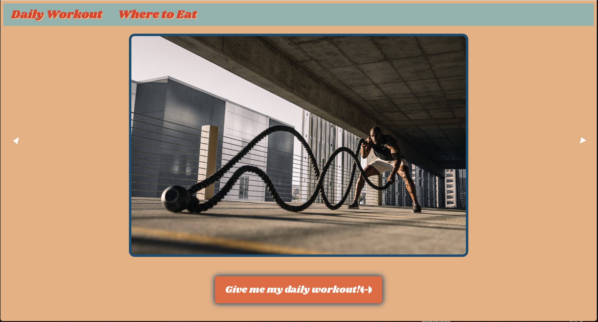

# <Workout & Post Meal Decider>

## Description

The motivation was to create a simple application that user could use immediately with little effort in order to take that first step in the fitness journey. With this project taking place at the top of the year, we decided to create an application that could be used to assist user along their fitness journeys.

A typical goal on New Year's resolutions is to hit the gym with the intention of committing to a healthier lifestyle.One of the diffuclties with getting started in the gym is the gap in knowledge regarding what actually gym moves to do? There are hundreds of moves and machines to use and as a novice it can become overwhelming at first. That overwhelming feeling can lead to a decommitment to the goal of a healthier lifestyle overtime.

Unfortunately what is overlooked is that starting anywhere is better than not starting at all. This application solves the "where do I even begin from problem" Thus creating a bridge over that first step of just beginning that seems so large.We learned that collaboration as a sofware developer is just as much a skill as learning to write and implement code. Communicating problems and coordinating schedules are the building blocks to building a cohesive team.

## Usage

From the opening page, click the button "Give me my daily workout"
From there two exercises with instructions will appear under the button.
Click the button again to refresh the exercises.

Next click the "where to eat icon" in the top left corner of the webpage.
Once at the second webpage, enter your zip code in the text area to.
That will then generate two options of where to eat after you workout.

Lastly at the bottom of that webpage is a button to remind you to drink your daily amount of water.
Click the "Daily Workout" icon in the top right of the webpage to return to your first webpage.

## Credits

Collaborators

Kelsey Morgan - https://github.commorgankn
Mahogany Hampton - https://github.com/mhampton123
Siu Ho Tsang - https://github.com/SiuTsang
Jordan Burrell - https://github.com/JustGritJordan

- Third-party assets that require attribution -

API Ninjas - Exercises API - https://api-ninjas.com/api/exercises
Yelp - https://docs.developer.yelp.com/reference/v3_business_search
Google Fonts - https://fonts.google.com/specimen/Shrikhand?query=shrik
Foundation Framework https://get.foundation/

## License

Liscense.MIT

## Links

Website - https://morgankn.github.io/Project-one/
Github - https://github.com/morgankn/Project-one/projects?query=is%3Aopen

## Screenshots

